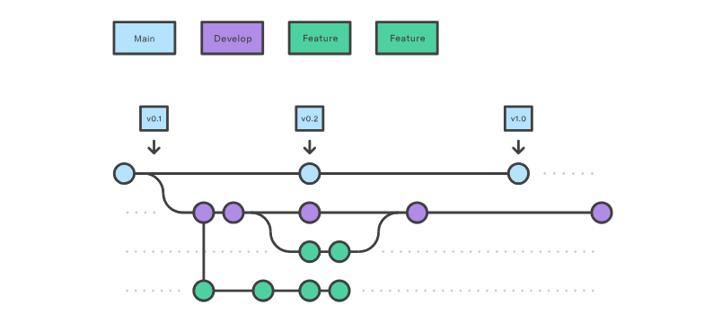
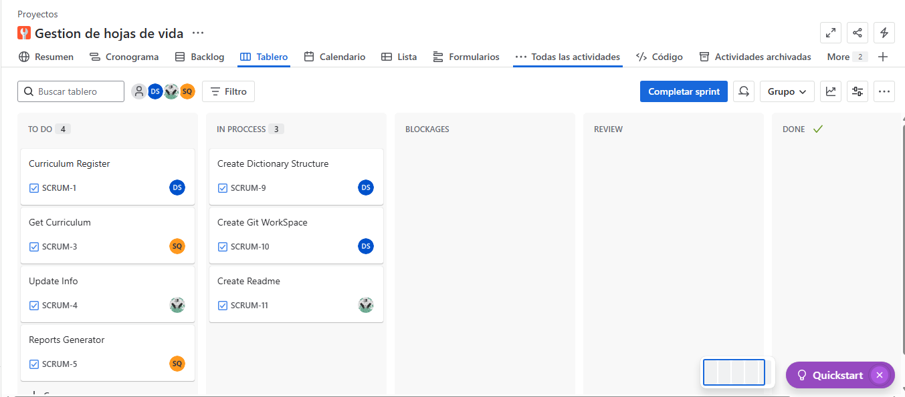

# Resume_management

# Mi Título Centrado

## We desided to use git flow and a structure: 
### main: to the main production branch, representing the stable, released code. 
### develop: The integration branch where the development team makes features. 
### feature: Branches created for developing specific features.
### release: A branch created from develop to prepare for a release, addressing minor bugs and final touches before releasing. 
### hotfix: Branches created from main to address  bugs in the production code.

## Also to describe variables we use "snake_case" (variable_case) and "camelCase" (funtionName) to named def in the proyect.

# Library used:
1. • datetime (to calculate time of age and experiences)
2. • json (To export curriculums)
3. • tabulate (to make a table of the information on cosole)
4. • collections.Counter (to filter skills and experiences)

## Our proyect structure:
 ├──Src
 |  ├──backend
 |  |   ├──conection-api
 |  ├──App.py
 |  ├──Curriculum.py
 |  ├──IdGenerator
 |  ├──Reports.py
 ├──README.md

 ## Work Organization

# • Jira

