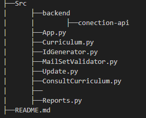

# Resume_management

## Group: 
### Ritchie: Cristian Chaverra, Samuel Quintero
### Van Rossum: Denis Sanchez

## Documentation

### We desided to use git flow: 
#### - main: to the main production branch, representing the stable, released code. 
#### - feature: Branches created for developing specific features.
#### - hotfix: Branches created from main to address  bugs in the production code.

### Also to describe variables we use "snake_case" (variable_case) and "camelCase" (funtionName) to named def in the proyect.

## Library used:
1. • datetime (to calculate time of age and experiences)
2. • json (To export curriculums)

### Our proyect structure:

 ### Work Organization

#### • [Jira](#https://contactdenissanchez.atlassian.net/jira/software/projects/SCRUM/boards/1)

## About project:

Resume management system that allows you to record personal, educational, professional, reference, and other data, with options to view, update, and export each registered resume.

### Dependences:
#### [Python 3.10](#https://www.python.org/downloads/)
#### or also you can watch this video: [Click](https://www.youtube.com/watch?v=9o4gDQvVkLU)

### Functions:
 1. Register new curriculum
 2. Get some curriculum from database
 3. Update the curriculum by ID, Name or Mail
 4. Create a Report 
 5. Close the program

### Simulated Data:

### Librarys:

- `json`: To serialize and save data in `.json` files
- `datetime`: To obtain report generation dates       

### How to run:

 1. Donwload Python 3.10
 2. Donwload Resume management zip
 3. Open cmd [(Terminal)](#https://www.youtube.com/watch?v=JvHHgnOqW4w)
 4. Go to the folder with App and type in terminal *python App.py*
