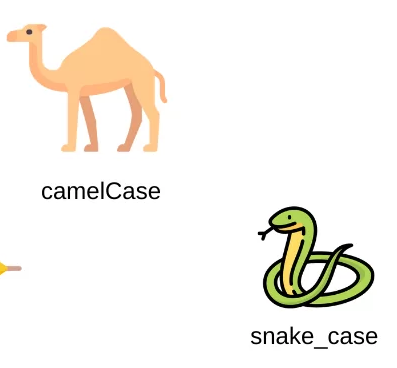

# Resume_management

## Documentation

### We desided to use git flow: 
#### - main: to the main production branch, representing the stable, released code. 
#### - feature: Branches created for developing specific features.
#### - hotfix: Branches created from main to address  bugs in the production code.

### Also to describe variables we use "snake_case" (variable_case) and "camelCase" (funtionName) to named def in the proyect.

## Library used:
1. • datetime (to calculate time of age and experiences)
2. • json (To export curriculums)

### Our proyect structure:
 > ├──Src
 > |      ├──backend
 > |      |        ├──conection-api
 > |      ├──App.py
 > |      ├──Curriculum.py
 > |      ├──IdGenerator.py
 > |      ├──MailSetValidator.py
 > |      ├──Update.py
 > |      ├──ConsultCurriculum.py
 > |      ├──
 > |      ├──Reports.py
 > ├──README.md

 ### Work Organization

#### • Jira [Link Text](#)

## About project:

Resume management system that allows you to record personal, educational, professional, reference, and other data, with options to view, update, and export each registered resume.

### Dependences:
- Python 3.10 [Link Text](#https://www.python.org/downloads/)
  or also you can watch this video: https://www.youtube.com/watch?v=cu_ykIfBprI(https://www.youtube.com/watch?v=9o4gDQvVkLU)

### Functions:
# 1. Register new curriculum
# 2. Get some curriculum from database
# 3. Update the curriculum by ID, Name or Mail
# 4. Create a Report 
# 5. Close the program

### How to run:

 1. Donwload Python 3.10
 2. Donwload Resume management zip
 3. Open cmd (Terminal) [Link text](#https://www.youtube.com/watch?v=JvHHgnOqW4w)
 4. Go to the folder with App and type in terminal *python App.py*